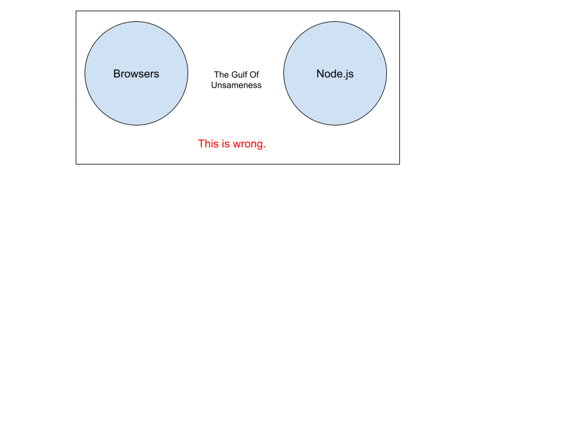
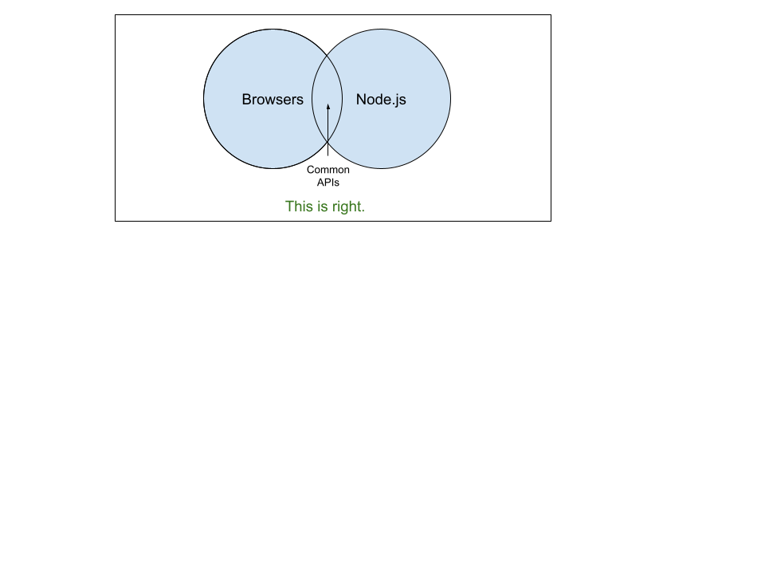

# Aligning Node.js with the Web Platform

* James M Snell (@jasnell on Twitter and Github)
* NearForm Head of Research
* Node.js Core Contributor, TSC member
* Contributor of many useful things:
  * URL
  * TextEncoder/TextDecoder
  * perf_hooks / User Timing API
  * Web Crypto
  * HTTP2
  * QUIC... soon

Consider this a Part 2 to my talk a few weeks ago at the NearForm Presents event: https://ibm.co/3vs2xWS

Key question: Should Node.js implement the same APIs as the browser?

Assertion: "Node.js is not a Browser."

The effort is not about turning Node.js into a browser,
or making everything from the browser available in Node.js.
It's about identifying the clear areas of overlap and sameness
and making those work consistently to make developers lives
easier.
